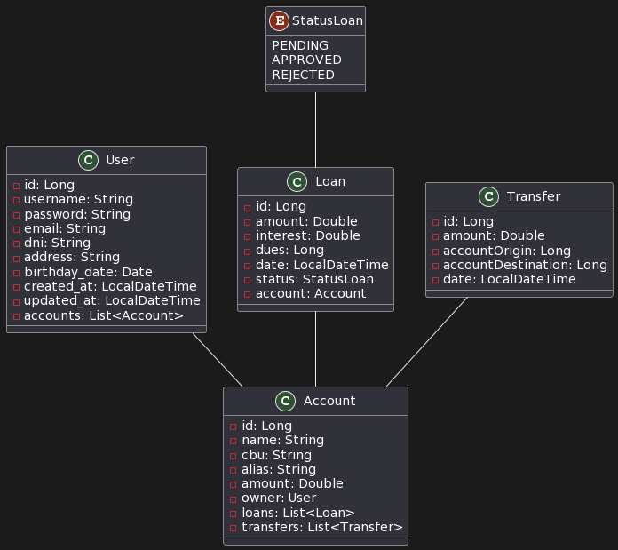

# tp-grupo-14
 Trabajo practico final de curso de Spring Boot en codo a codo. 

## Integrantes
 - Javier Pintos 
    + jpintos234@gmail.com
 - Sebastian Villegas 
    + soler2096@gmail.com
 - Alfredo Sponton		
    + alfredogs73@gmail.com
 - Esteban Luna Mercado		
    + raulestebanlunamercado@gmail.com
 - Cintia Castellan	
    + cintia01@gmail.com
 - Christian Fagan 
    + faganchrisitian@gmail.com
 - Marcos Castillo 
    + marcos469204@gmail.com

[Consigna TP](https://docs.google.com/document/d/15ljs8u2IyY3z4DIlqwdiv1JeHFROX6x8/edit)

## Consigna del Trabajo Práctico - "Spring Banking"

Descripción del Proyecto:

El proyecto consiste en el desarrollo de un simulador de acciones que replicará un sistema de Homebanking denominado "Spring Banking". Los alumnos formarán equipos de 6 desarrolladores para crear los servicios necesarios que permitan el funcionamiento del sistema. Se trabajarán sobre tres entidades principales: Usuarios, Cuentas (ya sea cuenta corriente o caja de ahorro) y Transferencias.

Requisitos Técnicos:

Utilizar Java 11 o 17 con Maven.
Conexión a la Base de Datos mediante JDBC.
Implementar Spring JPA y Hibernate para el manejo de la persistencia.
Configurar en el application.properties la conexión y las configuraciones (incluyendo ddl.auto=update).

Arquitectura del Proyecto:
Se trabajará sobre un Sistema Monolítico con las siguientes capas:

Controllers
Services
Mappers
DTO (Data Transfer Objects)
Entities
Repositories

Entidades y Relaciones:

Usuario:
Atributos: id, nombreUsuario, email, contraseña, dni, fecha_nacimiento, domicilio (dirección), lista de cuentas (List<Cuenta>).
Cuenta:
Atributos: id, tipo (ENUM), cbu, alias, monto, dueño (usuario dueño de la cuenta).
Transferencias:
id, monto, cuentaOrigen, cuentaDestino, fecha

Tareas a Realizar:

Desarrollar un CRUD para cada entidad (Usuarios, Cuentas, y Transferencias).
Establecer las relaciones entre entidades, garantizando la integridad de los datos.

Metodología de Trabajo:

División en Equipos: Se formarán equipos de 6 integrantes.

Distribución de Tareas:
Cada equipo se dividirá en 3 partes y cada una se encargará de una entidad (Usuarios, Cuentas, Transferencias). Utilizar Github y su metodología Github Flow o su derivado GitFlow.
En cada equipo, designar roles para cubrir el desarrollo de las capas definidas en la arquitectura del proyecto.
Coordinar reuniones regulares para revisar avances y resolver posibles obstáculos.

Entregables:
Repositorio Git con el código del proyecto (Se entregará 1 repositorio por equipo, pero las ramas de cada integrante del grupo deben permanecer activas para el momento de la corrección).

Consideraciones Finales:

Se evaluará la calidad del código, el manejo de las capas definidas, la correcta implementación de las relaciones entre entidades, y la funcionalidad del CRUD para cada entidad.

## consigna adicional

Sección Préstamos:
Se debe adicionar una entidad Préstamo para poder incrementar la cantidad de productos ofrecidos por el “Online Banking”. Para ello deberán definir los atributos y métodos que consideran necesarios para poder otorgarle préstamos a nuestros clientes y poder tener un registro de los mismos por cada cliente y adicionar un estado al mismo.

## Pruebas desde  [Thunder Client](https://www.thunderclient.com/)

Rest Client para probar la API. Admite colecciones [thunder-collection_API COC 23650](thunder-collection_API%20COC%2023650.json)

## UML

## Graficado desde  [🌱 PlantUML](https://plantuml.com/es/)
@startuml

class User {
  - id: Long
  - username: String
  - password: String
  - email: String
  - dni: String
  - address: String
  - birthday_date: Date
  - created_at: LocalDateTime
  - updated_at: LocalDateTime
  - accounts: List<Account>
}

class Account {
  - id: Long
  - name: String
  - cbu: String
  - alias: String
  - amount: Double
  - owner: User
  - loans: List<Loan>
  - transfers: List<Transfer>
}

class Loan {
  - id: Long
  - amount: Double
  - interest: Double
  - dues: Long
  - date: LocalDateTime
  - status: StatusLoan
  - account: Account
}

class Transfer {
  - id: Long
  - amount: Double
  - accountOrigin: Long
  - accountDestination: Long
  - date: LocalDateTime
}

enum StatusLoan {
  PENDING
  APPROVED
  REJECTED
}

class ClientLoan {
  - id: Long
  - dues: Long
  - pendDues: Long
  - status: StatusLoan
  - created_at: LocalDateTime
  - updated_at: LocalDateTime
  - account: Account
  - loan: Loan
}

User -- Account
Loan -- Account
StatusLoan  --  Loan 
Transfer -- Account 
Loan -- ClientLoan
Account -- ClientLoan

@enduml
